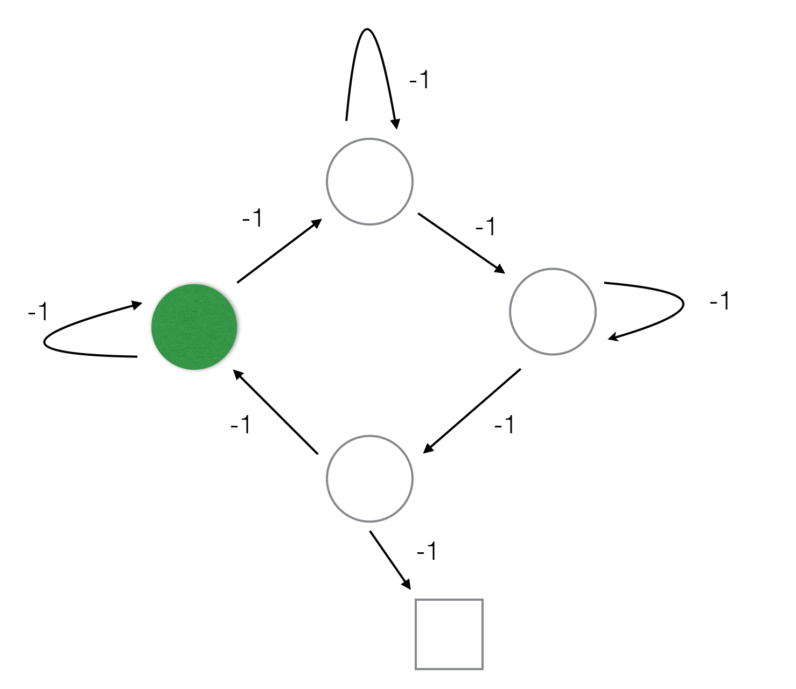
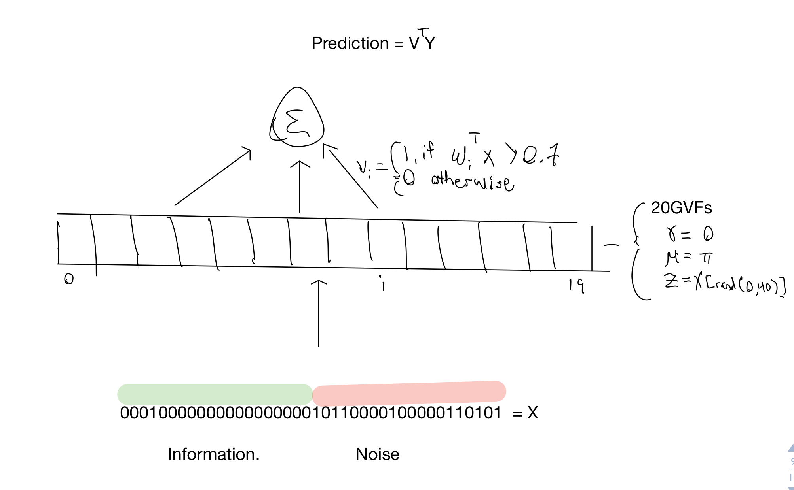
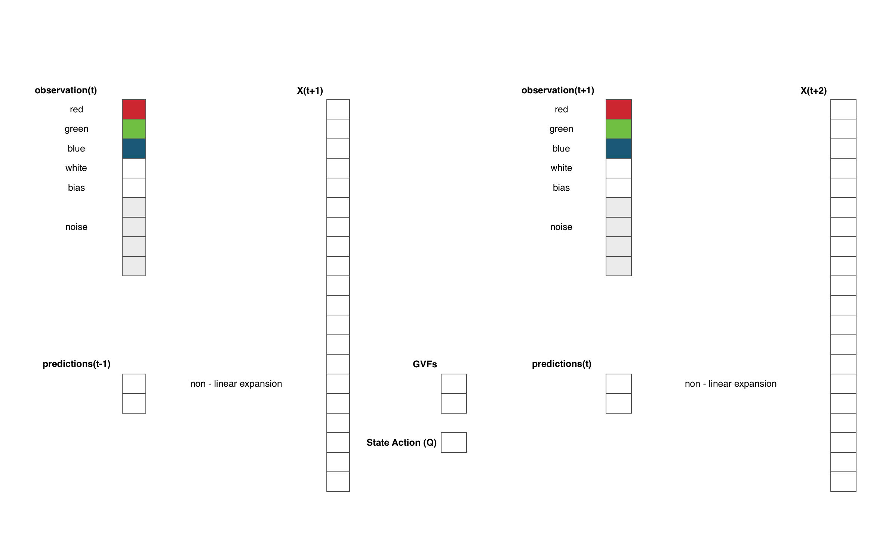
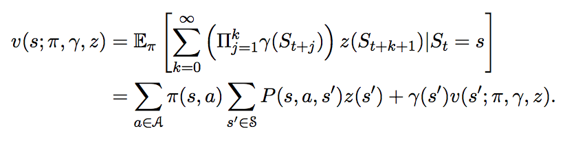
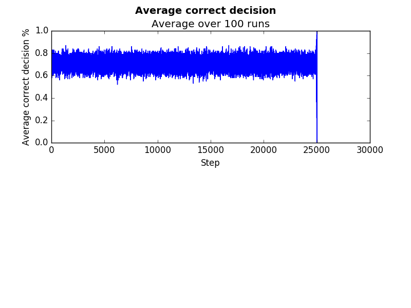
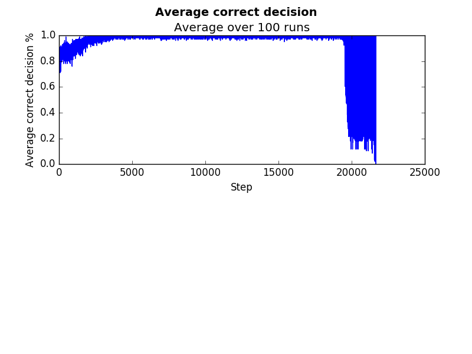
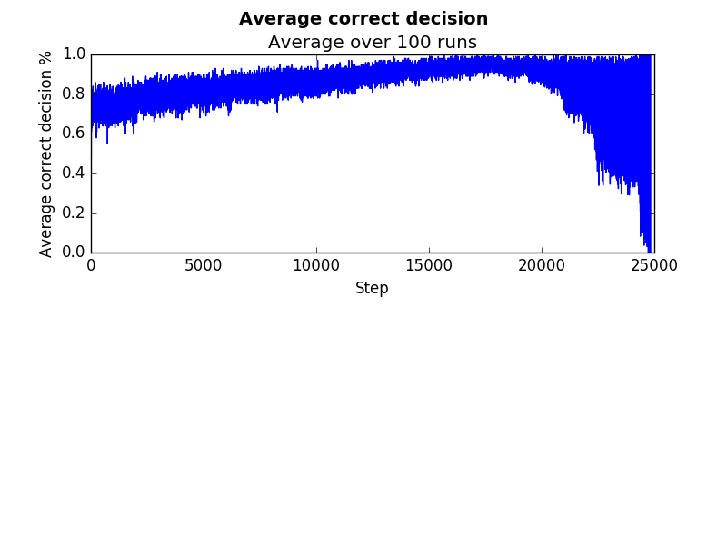

# CycleWorld
Predictive feature learning for a reinforcement learning task.

## Abstract
In some reinforcement learning environments, direct observations lack sufficient information to directly represent the agents state. One approach, in an effort to suffienctly describe agent state, is to augment these observations with predictive features. The experiments in this repository are conducted in such an information lacking environment, and attempt to discover useful predictive features.

## Introduction
A "feature" of an agents state can be considered as some measurable quantity of the current state it is in. As a human agent, this may be something like the color I am looking at, the room I am standing in, or whether I'm hot or cold. The most obvious features are those that describe the agents immediate observations, like the ones just mentioned. Other abstract features may be considered however. Those which encapsulate the past, such as which action it just took or how many steps it has taken forward.
A second type of more abstract feature would be those which predict some future quantity. For example, consider a basketball player standing at middle court. It may describe it's current state by a series of action based predictions.
- If I were to pass the ball to my teammate, what is the probability they catch it?
- If I were to shoot, what is the probability it will go in the net?
- If I were to continue dribbling forward, how long would it be until a turnover occured?
These predictive features are, in many ways, similar to historical features. Instead of looking to the past to describe the present, you are looking toward what is likely to happen in the future, to describe the present.
Historical, and predictive features are good for generalizing states. ie. Regardless of all other factors (where the player and her teammates are on the court, and the color of her shoes), it may be significant to know what is the probability she scores if she shoots?
Another strength of these types of features is demonstrated in environments where information is lacking in current observations. To best describe this, consider an example.

Imagine a human agent standing in the middle of a football field. Their task is to attempt to find the red helmet on the sidelines. They can see, and hear, as you would imagine with any human agent. 

Finding the helmet using just these senses seems easy. 

Now imagine you're on the same field, looking for the same helmet, but there's a severe helmet. Every direction the agent looks, appears to be the same - all they see is "white." 

If the agent were to only represent it's current state by considering these immediate observations, it would be lost, with no hope for navigating to the goal post. However, consider the agent constructing it's state differently. Imagine if the agent were to create features such as:
- If I were to walk straight, would I eventually end up in the oppositions endzone?
- If I were to turn left and then walk straight, would I eventually see a white yard line under me?
- If I were to walk straight, how many steps would it take to hit a goal post?

If the agent constructs, and estimates the right set of predictions, it's able identify where it is in the field, despite "only seeing white"?

It is such a setting that we look to create an agent architecture that is able to learn such predictive features that will allow the agent to represent it's state.

## Environment
Our environment is a slight adaptation to the Cycle world. The MDP is illustrated below.

There are 6 states oriented in a circle. Each state leads to the next in a clockwise fashion. The difference is that we introduce a second action we call "trigger." In all but one of the states, "trigger" transitions the state back to itself. In the one special state, tacking the "trigger" action takes the agent to a terminal state. The reward for each episode is -1. It is easy to see, that for such an environment, the optimal policy is one which moves forward at each state - except the "special state" - whose optimal action is to pull the trigger. The difficulty of learning this policy is state aliasing. Each "white" state looks exactly the same. Which action should be taken? With such aliasing, the agent will either always move, or always pull the trigger, when it is in a white state. Clearly, neither option results in an optimal policy.

To the agent the observation is seen as a bit stream as seen below.

The first 5 bits represent which color is seen. The 6th bit is a bias bit (always 1). And the last 5 bits are noise - randomly 0 or 1.

## Predictive state representation to the rescue ...
In such an environment, how could the agent differentiate one white state from another? Keeping a history of the observed colors and actions would be one option. However, an alternative forward approach is what we consider. For each state, imagine if we were able to predict "how many steps would we need to take forward before we observed green?" If, for each state, we were able to make this prediction accurately, each state would be uniquely identified. Coming up with these predictions dynamically is the next challenge. 

## A dynamic "horde" of demons.
In such an architecture, we include predictions as part of the state representation. 

The value of the predictions are tile coded before being placed into the overall feature representation.

These predictions will take the form of General Value Functions (GVFs). More information describing GVFs is available in [Adam White's thesis defense.](https://era.library.ualberta.ca/files/bg257h75k/White_Adam_M_201506_PhD.pdf) 

A GVF specifies a precise question about the agent's interaction with the world and the prediction is the agent's learned answer to that question. The GVF predicts aspects of future observations, dependent on a certain behavior. For example, A GVF may predict - "how many steps will I talk before I bump into the wall?" Or "How much red will I see in the future before I bump into the wall?"

The types of questions can vary in nature. This is done by changing the gamma, cumulant, and behavior policy functions. Collectively, these are the GVFs question functions.

With our knowledge of this environment, we could design such a GVF layer to specifically predict the green bit. But we want to design such a system that is dynamically able to generate the predictions that contribute information to the state representation. 

To do so, we introduce a generate and test design to our architecture. 

## Generate and test
'''
Generate random GVF layer
Repeat forever
Take action based on Action values
For each GVF, learn
If the episode is divisible by 25000:
- Determine weakest GVF
- Replace it with a new candidate GVF
Update state action values
'''

This algorithm involves the following:

#### Generate
After a certain number of time steps, our algorithm will "pause" to inspect the utility of each GVF and replace the one(s) that don't contribute information, with another candidate. Our algorithm thus needs to be able to generate, and test General value functions

As stated above, a GVF specifies a precise question about the agents interaction with the world.  The GVFs prediction is the learned approximation to that question. 

For our generation of GVFS we consider GVFs that measure when they will observe a certain bit in the future. These take two types, each of whom have policies to always go forward: 
1. Predicting whether you will see green in 1, 2, 3, or 4 steps. (counting GVFs)
- Gamma is 0.0 when the green bit is observed. 1.0 otherwise. 
- Cumulant is 1.0 when the green bit is observed. 0.0 otherwise.
2. Predicting how much green you will see in the future. (echo function)
- Gamma is 0.0 when the green bit is observed. 0.8 otherwise  
- gamma functions is 1.0 when green is observed, 0.0 otherwise

### Test
To test the utility of a GVF we look to determine how much it contributes to the overall decisions (Action values) our agent makes. Our agent uses double Q learning, which ascribes value to each action of each state. So in order to determine how much each GVF contributes to this, we look at the Q value weights associated to each GVF. 

The sum of the absolute values of these values is used to keep a "score" of these values.

### Kull
The agent is allowed to execute and take actions using the given GVF based representation for a number of time. The amount of time allowed to execute based on these GVFs needs to be enough so that the GVF can learn to make predictions, as well as for the state action values to be determined. For simplicity, in our case we have this set to 25000 episodes. When this occurs, our algorithm tests the utility of each GVF, and replaces the weakest performer with a new generated GVF.

## Results
The following are plots showing the result of various experiments using such an architecture.

### Predicting noisy bits
We artificially set the GVF layer to predict the noisy, information lacking bits. We also eliminated kulling. As you would imagine, the agent is only able to make the proper decision 50% of the time and no longer learns. 

### Predicting green bit
We artificially set the GVF layer to predict the green bit. We also eliminated kulling. As you would imagine, the agent is quickly able to learn a meaningful representation and make the correct decision ~ 100% of the time.

### Dynamic Horde
We artificially set the GVF layer to predict the green bit. We also eliminated kulling. As you would imagine, the agent is quickly able to learn a meaningful representation and make the correct decision ~ 100% of the time.

